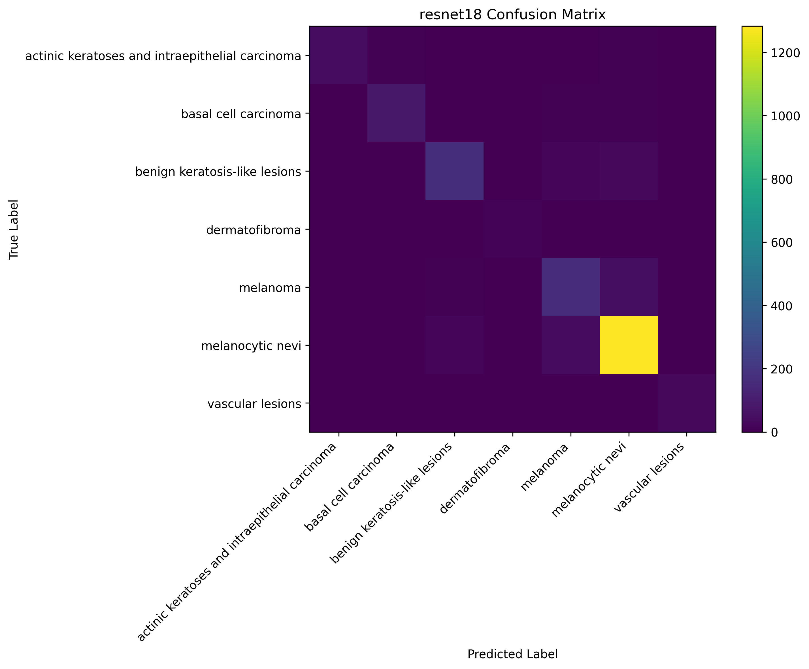
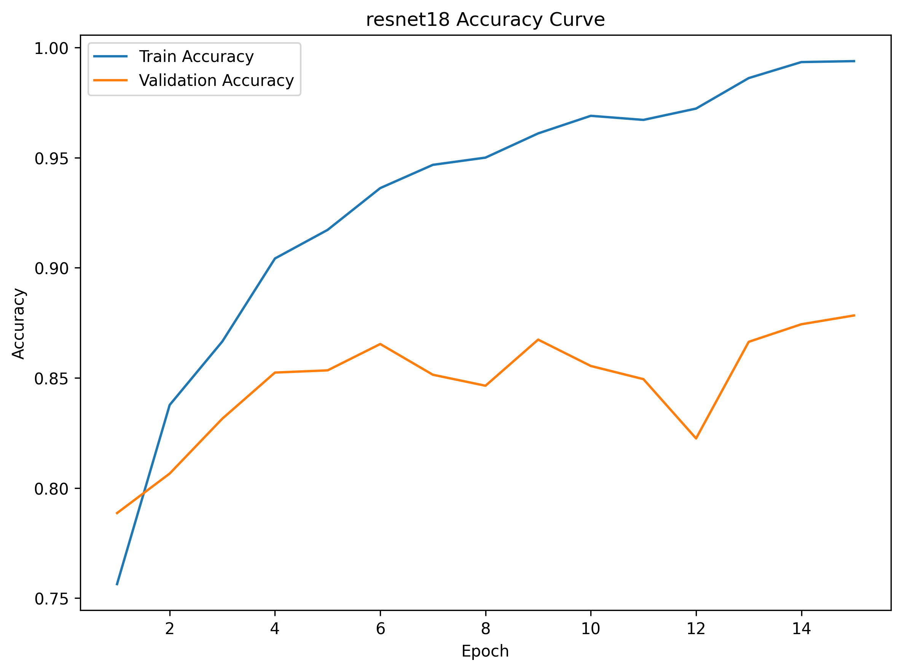
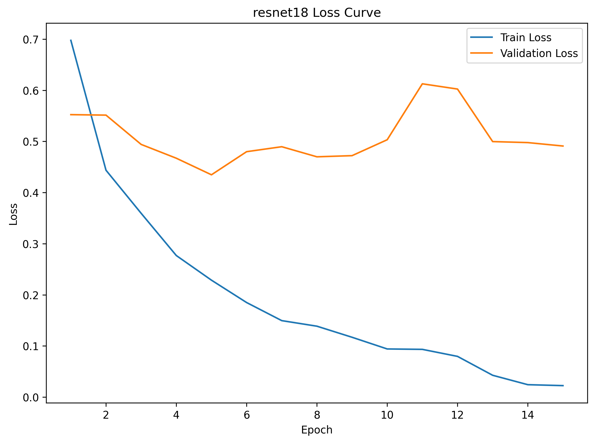

# Skin Lesion Classification with DermaMNIST

## Overview

This project explores skin lesion classification using the DermaMNIST dataset. I trained two models — a simple CNN built from scratch and a pretrained ResNet18 — and compared how well each one performs on a 7-class classification task. The main goal was to see whether transfer learning makes a meaningful difference in a biomedical imaging context.

---

## Clinical Context

Skin lesion classification supports early triage in dermatology by helping distinguish benign from potentially malignant lesions in dermoscopic images. In this project, the task is not to replace diagnosis, but to benchmark model performance on a medically relevant multi-class image classification problem and compare a from-scratch baseline to transfer learning.

---

## Setup

**1. Create and activate environment (recommended)**
```bash
python -m venv .venv
source .venv/bin/activate
```

**2. Install dependencies**
```bash
pip install torch torchvision medmnist scikit-learn matplotlib
```

---

## Run Instructions

**1. Train models**
```bash
python code/train.py
```

**2. Evaluate models**
```bash
python code/evaluate.py
```

**3. Plot training curves**
```bash
python code/plot_history.py
```

---

## Data Info

The project uses the **DermaMNIST** dataset from the [MedMNIST](https://medmnist.com/) collection. The scripts automatically download the dataset via the `medmnist` package when `download=True` is enabled in the dataloader setup.

- **Image size:** 224 × 224
- **Number of classes:** 7
- **Task:** Multi-class skin lesion classification
- **Splits used:** train / validation / test

**Classes:**
1. Actinic keratoses and intraepithelial carcinoma
2. Basal cell carcinoma
3. Benign keratosis-like lesions
4. Dermatofibroma
5. Melanoma
6. Melanocytic nevi
7. Vascular lesions

---

## Models

### SimpleCNN

A lightweight CNN trained from scratch. It uses a few convolutional layers with ReLU activations and max pooling, followed by a fully connected classifier. This serves as a baseline.

### ResNet18

A ResNet18 pretrained on ImageNet, fine-tuned for this task by replacing the final layer with a 7-class output head. This model benefits from features learned on a large general-purpose image dataset.

---

## Training Setup

- **Loss function:** CrossEntropyLoss
- **Optimizer:** Adam
- **Image size:** 224 × 224
- **Data augmentation:** Random horizontal flip, random rotation
- **Hardware:** GPU (HiPerGator HPC cluster)

---

## Results Summary

### Validation Accuracy

| Model | Accuracy |
|---|---|
| SimpleCNN | 75.67% |
| ResNet18 | **87.84%** |

### Test Performance

| Model | Accuracy | Precision | Recall | F1 Score |
|---|---|---|---|---|
| SimpleCNN | 0.7471 | 0.7178 | 0.7471 | 0.7185 |
| ResNet18 | **0.8863** | **0.8856** | **0.8863** | **0.8844** |

---

## Key Findings

ResNet18 outperformed the SimpleCNN by a wide margin across all metrics. The gap comes down to transfer learning — ResNet18 already knows how to detect edges, textures, and shapes from ImageNet pretraining, so it can pick up on subtle visual patterns in skin lesion images that a small CNN trained from scratch would struggle to learn. This makes a strong case for using pretrained models even in medical imaging tasks where domain shift might seem like a concern.

---

## Confusion Matrix



---

## Training Curves

### Accuracy



### Loss



---
